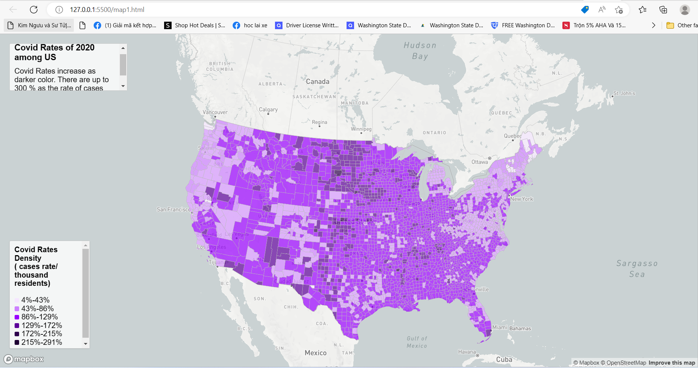
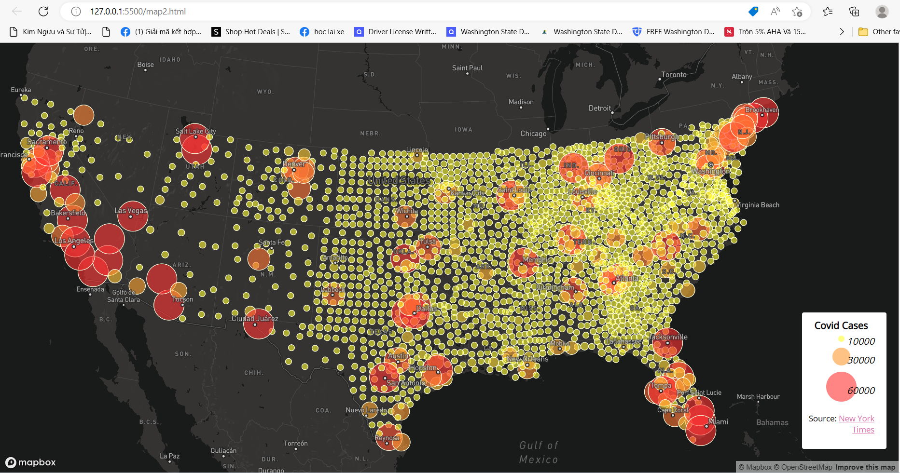

# Lab 3: Web Map Application
## Covid-19 Cases and Rate among US
In this lab, I design 2 web map applications: One is a propotional symbol map of Covid 19 cases among US in county level. Second is a choropleth map of the covid-19 rates among US in county level.

## Data source:
The data is COVID-19 case/death data are originally from [The New York Times](https://github.com/nytimes/covid-19-data/blob/43d32dde2f87bd4dafbb7d23f5d9e878124018b8/live/us-counties.csv) for both maps. The data include all the cases in 2020. The population data used for calculating the case rates are from the [2018 ACS 5 year estimates](https://data.census.gov/cedsci/table?g=0100000US.050000&d=ACS%205-Year%20Estimates%20Data%20Profiles&tid=ACSDP5Y2018.DP05&hidePreview=true). Both data are at the county level. The U.S. county boundary shapefile was downloaded from [the U.S. Census Bureau](https://www.census.gov/geographies/mapping-files/time-series/geo/carto-boundary-file.html).

## Map 1: Choropleth map of the covid-19 rates
Map 1: [Covid-19 Rate of US in 2020 in map1.html](http://127.0.0.1:5500/map1.html) as shown bellow:

This map shows the rates of people get covid 19 in county level. I use equal interval to represent the rates and the albers projection in this project. As shown, the bright purple fill all most 80 percentage of the US area. It mean, most of the state or counties have 86-129% of covid rate. The range shows clearly around 43%- 172%. There are 10-15% of the US has more than 172%. Darker purples are higher rates. 

Moreover, I also add the click point function, every time we move the mouse to an area, it will show the rate of that area such as 49.3 % of cases rate/ thousand residents. 

## Map 2: Proportional symbols map of covid-19 cases
Map2: [Covid-19 Cases of US in 2020 in map2.html](http://127.0.0.1:5500/map2.html) as shown bellow:

This map show the number of covid cases in county level. I break the cases number in 3 levels: 10000, 30000, 60000 as size 5, 15, 20 for the circle. The hotter color, the higher number of cases. It looks like West America has the higher cases reperensing by many yellow circles overlap and next to each other. But in the East might have more biggest circle (most in California and Oregon) than the West. The biggest cases of the West are in Florida and New York.

Moreover, I also ad click on function to the map. Everytime user clicks on a circle, it will show the number of cases in that areas.